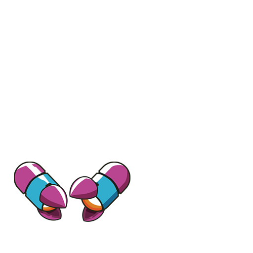
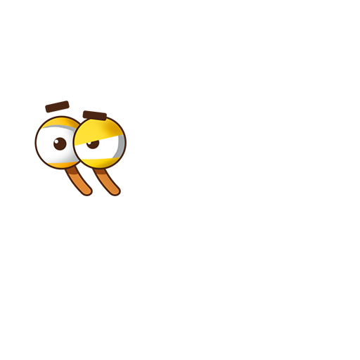
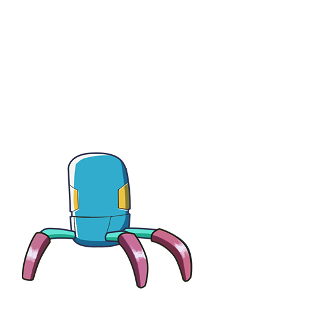
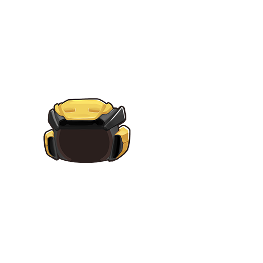
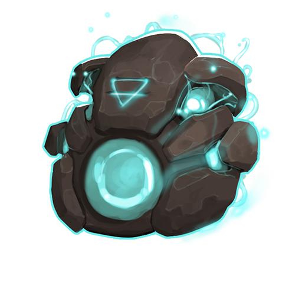

## Generate crab image
Crab image is generated based on the dominant genes in its DNA.
- Map the genes to the images in `images/crab-parts` we get the part image of a crab.
- Get dominant genes and respective images then merge them together we will have the crab image.

## Legend crab
- Legend crabs has the same *body parts* genes as normal crab.
- The legend parts are defined in the index from 24th to 29th of the dna.
- To get the legend part image we add `100` to the legend genes.

eg:
DNA = 14F0400000000000000000000004F4F422323413E4D3E4044401F4F4F3E4242

`legend shell id = 4` then the shell image is `shell_1004.png`

## Example

Eg:
- Crab's DNA = 14F0400000000000000000000004F4F422323413E4D3E4044401F4F4F3E4242
- Split the DNA to 32 parts

| type id | sub class id | legend shell id | legend horn id | legend body id | legend mouth id | legend eyes id | legend pincer id | reserve1 | reserve2 | reserve3 | reserve4 | reserve5 | reserve6 | shell dominant id | shell R1 id | shell R2 id | horn dominant id | horn R1 id | horn R2 id | body dominant id | body R1 id | body R2 id | mouth dominant id | mouth R1 id | mouth R2 id | eyes dominant id | eyes R1 id | eyes R2 id | pincer dominant id | pincer R1 id | pincer R2 id |
|---|---|---|---|---|---|---|---|---|---|---|---|---|---|---|---|---|---|---|---|---|---|---|---|---|---|---|---|---|---|---|---|
|01|4F|04|00|00|00|00|00|00|00|00|00|00|00|4F|4F|42|23|23|41|3E|4D|3E|40|44|40|1F|4F|4F|3E|42|42|

|Part|DNA|Image|
|--|--|--|
|pincer dominant id|3E (62)|`images/crab-parts/pincer/pincer_62.png` |
|eyes dominant id|1F (31)|`images/crab-parts/eye/eye_31.png` |
|mouth dominant id|40 (64)|`images/crab-parts/mouth/mouth_64.png` |
|body dominant id|3E (62)|`images/crab-parts/body/body_62.png` |
|horn dominant id|23 (35)|`images/crab-parts/horn/horn_35.png` |
|shell dominant id|4F (62)|`images/crab-parts/shell/shell_79.png` But the shell legend is `4` then the shell image is `images/crab-parts/shell/shell_1004.png` |

